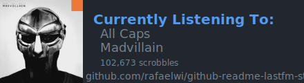

# GitHub Readme Last.fm Stats
Dynamically generated last.fm stats in your profile readme

[](https://app.netlify.com/sites/github-readme-lastfm-stats/deploys)

<hr>

## Contents
- [Usage](#usage)
- [Options](#options)
- [Demo](#demo)
- [Development & Deployment](#development--deployment)
- [Issues, Requests, and Contributing](#issues-requests-and-contributing)

<hr>

## Usage
To embed in your readme:
```

```
or
```


## Options
| Option | Example | Description |
| ------ | ------- | ----------- |
| user | `user=st-silver` | **(required)** The user to fetch info for |
| theme | `theme=light` **(default)**<br>`theme=dimmed`<br>`theme=dark` | **(optional)** The theme of the card. See the demo below to see how they look |
| show_scrobbles | `show_scrobbles=false` **(default)**<br>`show_scrobbles=true` | **(optional)** Selects whether or not to show scrobble count


<hr>

## Demo

```
https://github-readme-lastfm-stats.netlify.app/.netlify/functions/card?user=st-silver
```

<hr>

```
https://github-readme-lastfm-stats.netlify.app/.netlify/functions/card?user=st-silver&theme=dimmed
```

<hr>

```
https://github-readme-lastfm-stats.netlify.app/.netlify/functions/card?user=st-silver&theme=dark
```

<hr>

```
https://github-readme-lastfm-stats.netlify.app/.netlify/functions/card?user=st-silver&show_scrobbles=true
```

<hr>

```
https://github-readme-lastfm-stats.netlify.app/.netlify/functions/card?user=st-silver&theme=dimmed&show_scrobbles=true
```

<hr>

```
https://github-readme-lastfm-stats.netlify.app/.netlify/functions/card?user=st-silver&theme=dark&show_scrobbles=true
```

<hr>

## Development & Deployment
Developing and deploying this project requires setting an environment variable that holds your last.fm API key. [See here to find out how to get an API account.](https://www.last.fm/api#getting-started)

```
export LASTFM_STATS_KEY=your_key_here
```

This also needs to be done on your deployment platform of choice. For Netlify, this can be done under *Site Settings > Build & deploy > Environment*.

<hr>

## Issues, Requests, and Contributing

Found an issue or have a feature request? [Create a new one here](https://github.com/rafaelwi/github-readme-lastfm-stats/issues/new) and I will take a look at it ASAP. Please give as much detail as possible in your commment.

Like the project and want to lend a hand? Just make a pull request and I'll take a look.
